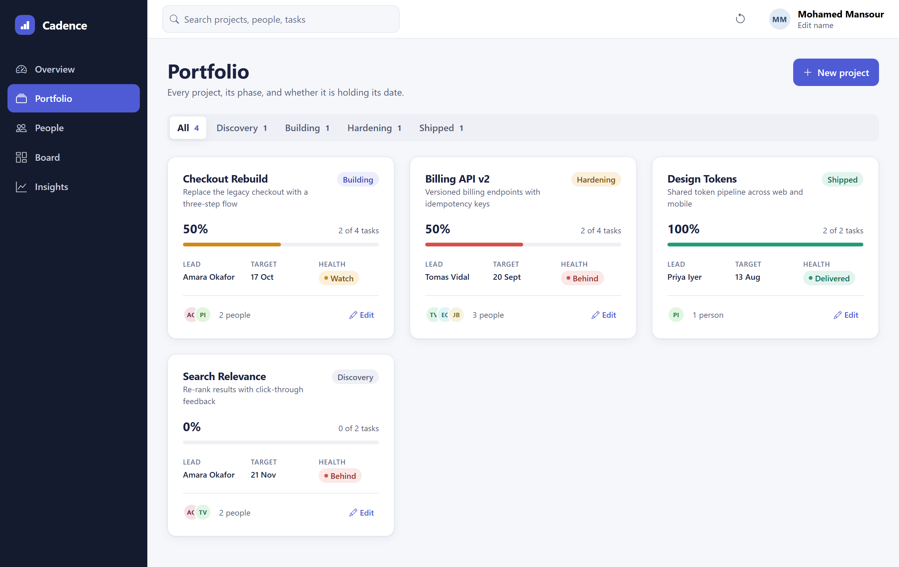

# Cadence

A delivery dashboard for engineering leads — projects, team workload, and
delivery trends in one place.

**Live demo:** https://drabdo1990.github.io/project-management-website/ ·
**Source:** https://github.com/drabdo1990/project-management-website

## What it does

Cadence starts empty. You add your own people, projects, and tasks, and
every figure on every screen is calculated from what you enter — nothing is
hardcoded, and nothing leaves your browser.

- **Overview** — portfolio summary, projects that need a decision, phase
  mix, and an activity feed
- **Portfolio** — every project with derived progress and a
  schedule-versus-scope health read
- **People** — the team sorted by workload against each person's declared
  capacity
- **Board** — a four-lane task board with drag-and-drop *and* keyboard moves
- **Insights** — throughput and median cycle time computed from real task
  history

Moving one card to *Shipped* updates the project's progress, the assignee's
workload, the portfolio health tile, and the delivery charts at once —
because none of those are stored, they are all derived from the tasks.

## Built with

React 19 · Bootstrap 5 · Recharts · Vite · React Router

State persists to `localStorage`; there is no backend. MIT licensed, built
from scratch.
