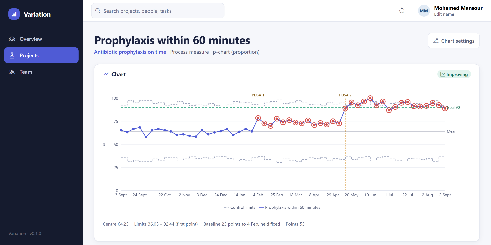

# Variation

Run charts and Shewhart control charts for clinical quality improvement.

**Live demo:** https://drabdo1990.github.io/variation/ ·
**Source:** https://github.com/drabdo1990/variation

## What it does

Variation is built around the Model for Improvement. A project has an
**aim**, a **family of measures** (outcome, process and balancing), and the
**PDSA cycles** you run to move them. You enter your own data and it works
out the chart — then tells you whether something genuinely changed or the
numbers just wobbled.

Six chart types, chosen by asking what you are counting rather than guessing
from the numbers:

| Your data | Chart |
|---|---|
| A proportion of a group, group size varies | **p-chart** |
| A count out of a fixed sample | **np-chart** |
| A rate over changing exposure | **u-chart** |
| A count over steady exposure | **c-chart** |
| A measured value per period | **XmR** |
| Not sure yet | **run chart** |

## Two things it gets right that a spreadsheet does not

**Limits are frozen from a baseline.** If you recalculate them every time you
add a point, the centre line drifts along with the improvement and the
improvement erases its own evidence. Variation holds the baseline limits and
extends them forward, so a sustained shift shows as the signal it is.

**Limits move with the denominator.** Most clinical measures are fractions —
43 of 50 patients, 7 falls in 1,240 bed-days. On a p- or u-chart the control
limits are wider when you audited twenty patients and tighter when you
audited two hundred, which is why the limits above are stepped.

## Signals

Run charts use the median and the run rules: a shift of 6 points one side,
a trend of 5, and a runs test. Control charts use the mean and 3σ limits: a
point outside the limits, 8 one side of centre, 6 trending, 2 of 3 beyond 2σ.
Every signal names the exact points it covers.

The statistics live in a dependency-free module tested against worked
examples — one per chart type, with the expected centre line and limits
computed independently — because a control chart that is subtly wrong is
worse than no control chart.

## Built with

React 19 · Bootstrap 5 · Recharts · Vite · Vitest

Everything is stored in your browser; there is no backend and nothing is
transmitted. MIT licensed, built from scratch.
